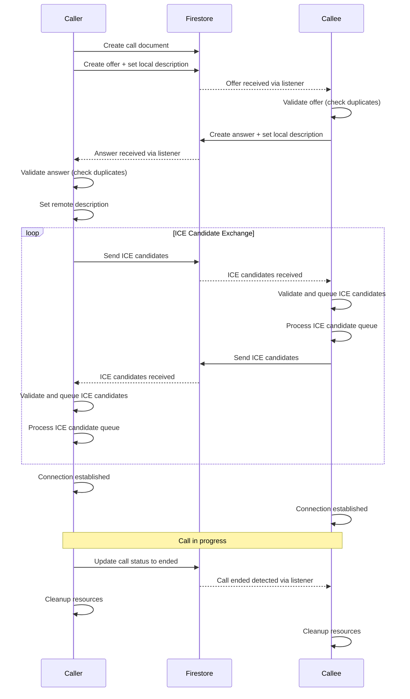

# WebRTC Signaling Flow (Improved)

This diagram shows the improved signaling flow with:

1. **Duplicate Prevention**: Both caller and callee validate offers/answers to prevent duplicate processing
2. **ICE Candidate Queueing**: Candidates are queued and processed in order to prevent race conditions
3. **Enhanced Validation**: All signaling messages are validated before processing
4. **Proper Cleanup**: Resources are cleaned up when the call ends